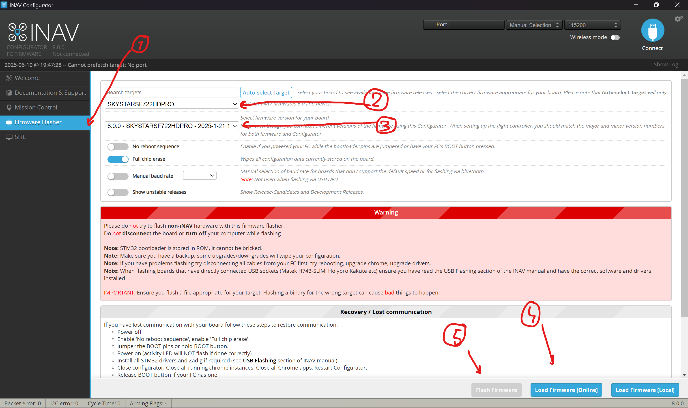

# INAV 8.0.0 для IFLIGHTF7_SUCCEXE и SKYSTARSF722HD4PRO

## Файлы

- [Папка IFLIGHTF7_SUCCEXE](IFLIGHTF7_SUCCEXE) — исходники для сборки прошивки для IFLIGHTF7_SUCCEXE.
- [inav_8.0.0_IFLIGHTF7_SUCCEXE.hex](inav_8.0.0_IFLIGHTF7_SUCCEXE.hex) — собранная и проверенная прошивка.
- [final_skystars_hd_4_pro_INAV_8.0.0_cli_20250609_204131.txt](final_skystars_hd_4_pro_INAV_8.0.0_cli_20250609_204131.txt), [final_INAV_8.0.0_cli_20250423_203116.txt](final_INAV_8.0.0_cli_20250423_203116.txt) — внутренние параметры для загрузки через CLI в INAV Configurator.
- [dji.nazam](dji.nazam) - настройки для джи полётника(в красном хорнете стоит)

## INAV

1. Скачайте [INAV Configurator](https://github.com/iNavFlight/inav-configurator/releases) версии 8.0.0 или выше для прошивки и настройки полетного контроллера.
2. Для прошивки используйте вкладку `Firmware Flasher`:
   - Для плат SKYSTARS используйте таргет `SKYSTARSF722HD4PRO`. Что надо выбрать в INAV Configurator по шагам:
     
   - Для плат SucceX-E загрузите прошивку локально из папки `FINAL`. Таргет выбирать не нужно — нажмите `Load Firmware [Local]` и выберите файл прошивки? затем прошивайте.

## Настройка полетника

После прошивки подключите полетник к INAV Configurator, перейдите во вкладку `CLI` и выполните команды из соответствующего файла параметров:
- Для SKYSTARS: `final_skystars_hd_4_pro_INAV_8.0.0_cli_20250609_204131.txt`
- Для SucceX-E: `final_INAV_8.0.0_cli_20250423_203116.txt`

Если необходимо ограничить максимальную высоту полета в автоомном режиме, выполните команду:
`set nav_max_altitude = 80` (где `80` — максимальная высота в сантиметрах).
После выполнения команд не забудьте сохранить изменения, выполнив `save`.

## ERLS: Бинд-фразы

Бинд-фразы имеют вид `hornet<number>`, где `<number>` — номер рамы (например, `hornet1`, `hornet2` и т.д.).

Инструкция по биндингу приведена в [документации ExpressLRS](https://expresslrs.ru/Manuals/Binding/).

## Сборка прошивки

Процесс сборки описан в [документации INAV](https://github.com/iNavFlight/inav/blob/master/docs/development/Building%20in%20Windows%2010%20or%2011%20with%20Linux%20Subsystem.md).

## ToDo

- Проверить калибровку датчика напряжения — корректно ли отображаются значения.